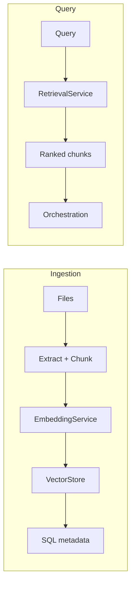

# PDF-Based RAG Platform

A polished, production-style conversational AI repository for retrieval-augmented generation over local documents.

This project combines structured document ingestion, vector retrieval, SQL persistence, and optional workflow orchestration to deliver a professional RAG platform with strong developer ergonomics.

---

## What This Project Is

- **Conversational retrieval platform** for PDF, DOCX, and TXT files
- **Persistent vector search** via ChromaDB
- **Structured SQL traceability** for sessions, messages, and retrieval logs
- **Optional workflow orchestration** with typed state propagation
- **Extensible platform** built for portfolio and technical review

---

## Engineering Motivation

This repository is designed as a bridge between prototype RAG apps and production engineering quality.
It preserves existing CLI and Streamlit interfaces while adding:

- modular service boundaries
- typed architecture and workflow plumbing
- production-style observability
- runtime toggles for classic vs workflow paths
- clean onboarding for engineers and reviewers

---

## Architecture Summary

### Core modules

- `services/` — ingestion, retrieval, generation, and RAG façade
- `workflow/` — optional workflow graph, nodes, and state propagation
- `vectorstores/` — vector store abstraction and Chroma backend
- `database/` — SQLite persistence, repositories, chat records, and retrieval logs
- `document_processing/` — extraction and chunking pipeline
- `ml/` — evaluation and tracking integration

### High-level flow

1. Document ingestion produces metadata-rich chunks
2. Embeddings are stored in a vector store
3. Retrieval fetches relevant chunks for a query
4. Answers are generated by a prompt-guided LLM flow
5. SQL records preserve session and retrieval traceability

---

## Orchestration Paths

### Classic orchestration

The default behavior uses the existing `RagOrchestrator` path.
This path is optimized for reliability and compatibility with earlier phases.


### Workflow orchestration

The optional workflow path builds a typed state bag and runs a configurable node graph.
It is enabled by runtime configuration and preserves the classic API surface.


---

## Retrieval and Persistence Pipeline

- `document_processing/` extracts and chunks PDF, DOCX, and TXT files
- `embeddings/` transforms chunks into vector embeddings
- `vectorstores/` stores and retrieves semantically matched chunks
- `database/` records documents, sessions, messages, and retrieval logs
- `services/retrieval_service.py` is the typed entrypoint for vector search



---

## Observability and MLflow

This repository is designed for engineering-grade observability:

- `ml/` integrates MLflow-compatible tracking adapters
- workflow execution IDs identify graph runs
- orchestration metrics capture prompt, generation, and retrieval timings
- evaluation outputs are available when workflow evaluation is enabled
- fallback behavior is instrumented for safe production execution


---

## Runtime Workflow Toggles

The platform supports runtime flags for workflow control.

| Flag | Purpose | Default |
|---|---|---|
| `WORKFLOW_ENABLED` | Enable workflow graph execution | `false` |
| `WORKFLOW_FALLBACK_ENABLED` | Fall back to classic orchestration on workflow failure | `true` |
| `WORKFLOW_OBSERVABILITY_ENABLED` | Workflow observability hooks | `true` |
| `WORKFLOW_EVALUATION_ENABLED` | Enable or disable workflow evaluation node | `true` |

```env
WORKFLOW_ENABLED=true
WORKFLOW_FALLBACK_ENABLED=true
WORKFLOW_OBSERVABILITY_ENABLED=true
WORKFLOW_EVALUATION_ENABLED=true
```

If `use_workflow` is provided to public service calls, it overrides the config default for that request.

`app.py` and `main.py` load `WorkflowConfig.from_env()`. With `.env.example` defaults, the **classic orchestration path** remains active.

---

## Quick Start

### 1. Create a virtual environment

```powershell
py -3.11 -m venv .venv
.\.venv\Scripts\Activate.ps1
python -m pip install --upgrade pip
```

### 2. Install dependencies

```powershell
pip install -r requirements.txt
pip install -r requirements-dev.txt
```

### 3. Configure environment

```powershell
Copy-Item .env.example .env
```

Update `.env` with your API key and runtime settings.

### 4. Run the app

```powershell
make run
```

### 5. Start a query session

```powershell
python main.py
```

### 6. Run tests

```powershell
make test
```

---

## Engineering Highlights

- Modular orchestration architecture with a classic and workflow path
- Typed workflow state propagation via `workflow/state.py`
- MLflow-compatible tracking and evaluation instrumentation
- Safe fallback execution from workflow to classic orchestration
- Citation-aware retrieval using metadata-rich chunks
- `mypy`-friendly type boundaries across services and workflow
- Comprehensive regression coverage under `tests/`

---

## Recommended Commands

```powershell
make setup
make test
make mypy
make lint
make run
```

---

## Environment Variables

Copy `.env.example` to `.env` and set secrets locally. Never commit `.env`.

| Category | Variables |
|----------|-----------|
| **Required for Q&A** | `GROQ_API_KEY` |
| **Models** | `LLM_MODEL`, `EMBEDDING_MODEL` |
| **Storage** | `DATA_DIR`, `SQLITE_PATH`, `CHROMA_PERSIST_DIR`, `DOCUMENTS_DIR` |
| **Workflow** | `WORKFLOW_ENABLED`, `WORKFLOW_FALLBACK_ENABLED`, `WORKFLOW_OBSERVABILITY_ENABLED`, `WORKFLOW_EVALUATION_ENABLED` |
| **Observability (optional)** | `MLFLOW_ENABLED`, `MLFLOW_TRACKING_URI`, `MLFLOW_EXPERIMENT_NAME` |

Full annotated sample: [`.env.example`](.env.example). Deeper reference: [`docs/DEPLOYMENT.md`](docs/DEPLOYMENT.md).

---

## CI/CD

GitHub Actions runs at the **repository root** (monorepo) when `pdf_based_rag/` changes:

| Step | Command |
|------|---------|
| Tests | `python -m pytest tests/ -v` |
| Types | `python -m mypy` |
| Compile | `python -m compileall -q -x "\.venv" .` |

Workflow file: [`.github/workflows/ci.yml`](../.github/workflows/ci.yml) (Python 3.11, Ubuntu).

---

## Deployment & Docker

### Health check

```powershell
python scripts/healthcheck.py
```

Verifies imports and a writable `DATA_DIR`. Warns if `GROQ_API_KEY` is unset. Does not call external APIs.

### Docker (Streamlit UI)

```powershell
Copy-Item .env.example .env
# Set GROQ_API_KEY in .env

docker compose up --build
```

Open http://localhost:8501. Persistent state is stored in the `rag_data` volume (`DATA_DIR`).

### Startup summary

1. Configure `.env` from `.env.example`.
2. Add documents under `documents/` or upload via Streamlit.
3. Run `streamlit run app.py` or `docker compose up`.
4. Optional CLI: `python main.py`.

Production notes, volume layout, and workflow rollout guidance: [`docs/DEPLOYMENT.md`](docs/DEPLOYMENT.md).

Developer onboarding: [`docs/DEVELOPMENT.md`](docs/DEVELOPMENT.md).

---

## Visuals & Review Notes

The repository is structured for a clean technical presentation. Suggested assets for future portfolio review include:

- Streamlit interface screenshot showing query and document upload flow
- MLflow tracking dashboard screenshot for workflow execution metrics
- Orchestration metrics summary table for prompt/generation timings
- Workflow state propagation diagram for architecture presentations

---

## Project Structure

```text
pdf_based_rag/
├── app.py                    # Streamlit UI entrypoint
├── main.py                   # CLI entrypoint
├── answer.py                 # backwards-compatible QA wrapper
├── ingest.py                 # backwards-compatible ingestion wrapper
├── llm_generator.py          # generation compatibility wrapper
├── database/                 # persistence and repository layer
├── document_processing/      # extraction + chunking pipeline
├── embeddings/               # embedding service
├── ml/                       # evaluation and tracking
├── models/                   # typed dataclasses
├── services/                 # ingestion, retrieval, generation, RAG facade
├── vectorstores/             # vector store abstractions and backends
├── workflow/                 # optional workflow graph and nodes
├── tests/                    # regression and integration tests
├── config/                   # runtime configuration and workflow flags
├── docs/                     # deployment and developer guides
├── scripts/                  # operational scripts (healthcheck)
├── utils/                    # logging helpers and utilities
├── Dockerfile                # container image for Streamlit UI
├── docker-compose.yml        # local/production-style compose stack
└── .env.example              # sample runtime configuration (no secrets)
```

---

## Roadmap

- Add structured citation generation and source-aware response formatting
- Improve query-time prompt tuning and scoring
- Expand MLflow dashboards for workflow analysis
- Add strong onboarding docs and architecture diagrams
- Prepare for future multi-agent orchestration and CrewAI integration

---

## Notes for Reviewers

This repository is intentionally ready for engineering review. It balances current behavior with a clean modular foundation that supports later phases without rewriting the core orchestration or service APIs.
